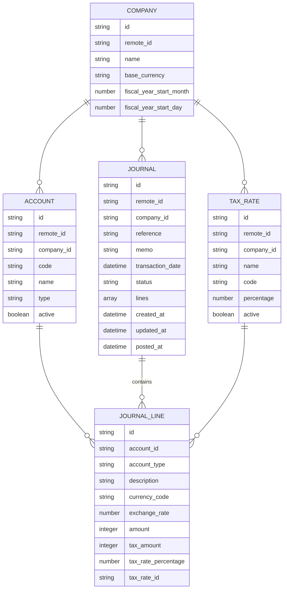

import unifiedApisBenefits from '/snippets/unified-apis-benefits.mdx';
import LegacyUnifiedApisNotice from "/snippets/legacy-unified-apis-notice.mdx";
import sdkOpenApiSection from "/snippets/sdk-open-api-section.mdx";
import sdkPageRedirect from "/snippets/sdk-page-redirect.mdx";
import UnifiedApiPrimer from "/snippets/unified-api-primer.mdx";

<LegacyUnifiedApisNotice />

<UnifiedApiPrimer />

The StackOne unified API handles financial data management across diverse accounting platforms, managing variations in chart of accounts, transaction structures, and reporting formats while supporting customer-specific workflows and compliance requirements. It enables financial data synchronization, reporting, and analysis without relying on provider-specific schemas. With 2-way API interaction, accounting systems can efficiently manage financial data from multiple sources through a single integration.

## Benefits of the Accounting API

<unifiedApisBenefits
category="accounting"
/>

## Key Features

| **Feature**                    | **Description**                                                                             |
| ------------------------------ | ------------------------------------------------------------------------------------------- |
| Chart of Accounts Management  | Easily create and manage chart of accounts across multiple accounting platforms with unified fields |
| Transaction Synchronization   | Keep financial transactions, journal entries, and balances synchronized across all integrated systems |
| Real-Time Webhooks             | Receive instant notifications for new transactions, account changes, and financial updates |
| Multi-Entity Support           | Manage multiple companies, subsidiaries, and business units within a single integration |
| Financial Reporting            | Generate standardized financial reports and statements across different accounting systems |

## StackOne SDKs & OpenAPI Specification

<sdkPageRedirect />
<CardGroup cols={2}>
  <Card title="OpenAPI Specification" icon="link" href="https://api.eu1.stackone.com/oas/accounting.json" arrow="true" cta="Click here"/>
  <sdkOpenApiSection />
</CardGroup>

## Entity Model and Relationships

The following diagram illustrates the key entities within the Accounting API:

## Entity Definitions

| Entity              | Description                                                                                 |
| ------------------- | ------------------------------------------------------------------------------------------ |
| Company   | A business entity with financial records, including base currency and fiscal year settings. |
| Account   | A financial account within the chart of accounts, representing assets, liabilities, equity, revenue, or expenses. |
| Journal   | A journal entry containing multiple lines that maintain accounting equation balance.        |
| JournalLine         | Individual line within a journal entry, linked to a specific account with amount and tax details. |
| Tax Rate   | Defines a tax rate (e.g., VAT, GST) for a company, including percentage, code, and status. |
