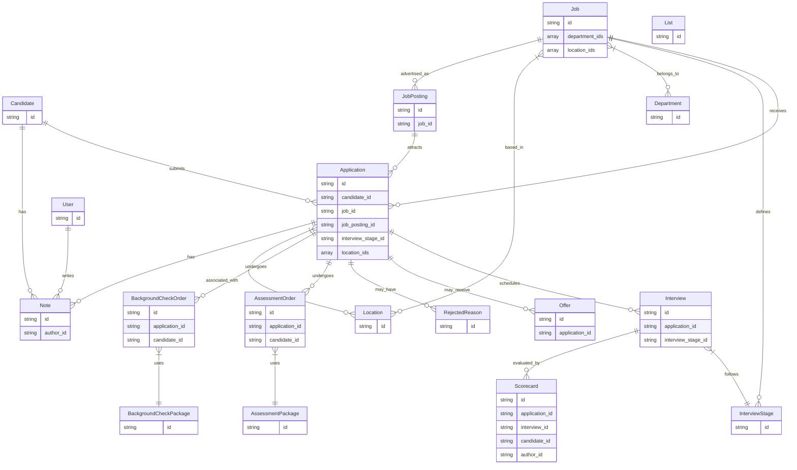

import LegacyUnifiedApisNotice from "/snippets/legacy-unified-apis-notice.mdx";
import sdkOpenApiSection from "/snippets/sdk-open-api-section.mdx";
import sdkPageRedirect from "/snippets/sdk-page-redirect.mdx";
import UnifiedApiPrimer from "/snippets/unified-api-primer.mdx";

<LegacyUnifiedApisNotice />

<UnifiedApiPrimer />

## Benefits of the ATS API

<AccordionGroup>
  <Accordion title="Real-Time Data Synchronization">
    StackOne's APIs interfaces with the underlying systems in real-time, allowing for immediate updates and synchronization across platforms.
  </Accordion>

  <Accordion title="Privacy-First Design Ensuring Compliance">
    With a [focus on security](https://www.stackone.com/blog/why-your-choice-of-unified-api-could-make-or-break-compliance), StackOne's architecture avoids unnecessary data storage, maintaining compliance with data protection regulations.
  </Accordion>

  <Accordion title="Synthetic and Native Webhooks for Updates">
    The platform provides both [synthetic and native webhooks](/legacy-unified-apis/common-guide/webhooks), enabling real-time notifications for candidate and job posting changes.
  </Accordion>

  <Accordion title="Comprehensive ATS Integration Coverage">
    StackOne offers [pre-built connectors](https://www.stackone.com/integrations) with a wide range of ATS platforms, simplifying the integration process.
  </Accordion>
</AccordionGroup>

## Key Features

The table below shows key features of the ATS API that make recruitment easier, from real-time application tracking and offer Management:

| **Feature**                        | **Description**                                                                                                 |
| ---------------------------------- | --------------------------------------------------------------------------------------------------------------- |
| Comprehensive Candidate Management | Easily create, update, and retrieve candidate profiles, including personal information and application history. |
| Job Postings and Metadata          | List and manage job postings, access detailed descriptions, compensation ranges, and related questionnaires.    |
| Application Tracking               | Monitor and update application statuses, manage interview stages, and handle offer details.                     |
| Real-Time Webhooks                 | Receive instant notifications for changes in data like - candidates, applications, or job postings.             |
| Document Handling                  | Upload, download, and manage candidate documents such as resumes and cover letters.                             |
| Interview Scheduling               | Record and manage interview details, including times, participants, and locations.                              |
| Offer Management                   | Handle job offers, track their status, and manage candidate responses efficiently.                              |

## StackOne SDKs & OpenAPI Specification

<sdkPageRedirect />
<CardGroup cols={2}>
  <Card title="OpenAPI Specification" icon="link" href="https://api.eu1.stackone.com/oas/ats.json" arrow="true" cta="Click here"/>
  <sdkOpenApiSection />
</CardGroup>

## Entity Model and Relationships

The following diagram illustrates the key entities within the ATS API:

The following table outlines key entities within the ATS system and provides a brief description of each:

| Entity                    | Description                                                                                                                                                        |
| ------------------------- | ------------------------------------------------------------------------------------------------------------------------------------------------------------------ |
| Applications              | Manages job applications, including creation date, status, linked job and candidate identifiers, and more.                                                         |
| Application Offers        | Handles job offers associated with applications, providing information on offer status, details, responses, and tracking from creation to acceptance or rejection. |
| Interviews                | Records details of candidate interviews, including times, participants, and location (e.g., meeting URL).                                                          |
| Interview Stages          | Represents different interview process stages, such as initial screening, technical rounds, and final interviews.                                                  |
| Rejected Reasons          | Manages standardized reasons for candidate application rejections, aiding in consistent decision-making and recruitment process analysis.                          |
| Candidates                | Provides detailed profiles of job candidates, including personal information, qualifications, application status, and history with the company.                    |
| Candidate Notes           | Manages notes related to specific candidates, including content (usually simple text strings) and author.                                                          |
| Users                     | Manages user accounts within the ATS, including recruiters, HR personnel, and hiring managers, with access to user details, roles, and permissions.                |
| Jobs                      | Manages job positions within the organization, including title, location, and status.                                                                              |
| Job Postings              | Focuses on the public aspect of the job, including extended descriptions, compensation ranges, and related questionnaires for applying.                            |
| Locations                 | Manages geographical locations associated with a job or job posting.                                                                                               |
| Departments               | Manages organizational departments that jobs are associated with.                                                                                                  |
| Scorecards                | Tracks evaluations and feedback from interviewers about candidates, including ratings and comments.                                                                |
| Lists                     | Manages custom lists that can be used to group candidates, jobs, or other entities.                                                                                |
| Assessment Packages       | Defines assessment tests that candidates can take during the hiring process.                                                                                       |
| Assessment Orders         | Records instances of assessments assigned to specific candidates.                                                                                                  |
| Background Check Packages | Defines background check processes that candidates may undergo.                                                                                                    |
| Background Check Orders   | Records instances of background checks performed on specific candidates.                                                                                           |
| Notes                     | Manages notes that can be associated with various entities like applications, candidates, etc.                                                                     |

## Use cases

<CardGroup cols={3}>
  <Card title="Job Board Application Tracking" href="/ats/use-cases/job-board-easy-apply">
    Job boards can post positions, accept applications, and monitor candidate progress through normalized recruitment stages via a single API that handles the complete application lifecycle.
  </Card>

  <Card title="Interview Insights" href="/ats/use-cases/interview-intelligence">
    Interview intelligence platforms can access structured interview data, update scorecards, and analyze candidate performance across standardized evaluation criteria.
  </Card>

  <Card title="Candidate Screening" href="/ats/use-cases/application-screening">
    Screening solutions can retrieve applications, process candidate data through qualification algorithms, and update application stages with acceptance or rejection reasoning using standardized fields.
  </Card>

  <Card title="Assessment & Background Checks" href="/ats/use-cases/assessment-flow">
    Providers can receive candidate evaluation orders, update test results, and automatically update application statuses with standardized scoring data that feeds directly into the hiring decision process.
  </Card>
</CardGroup>
