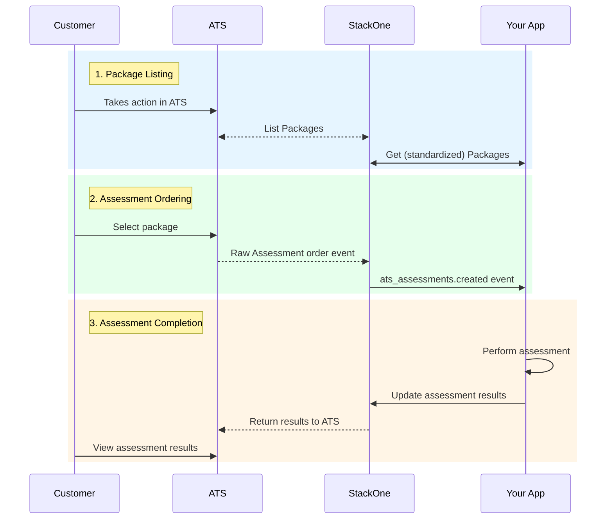
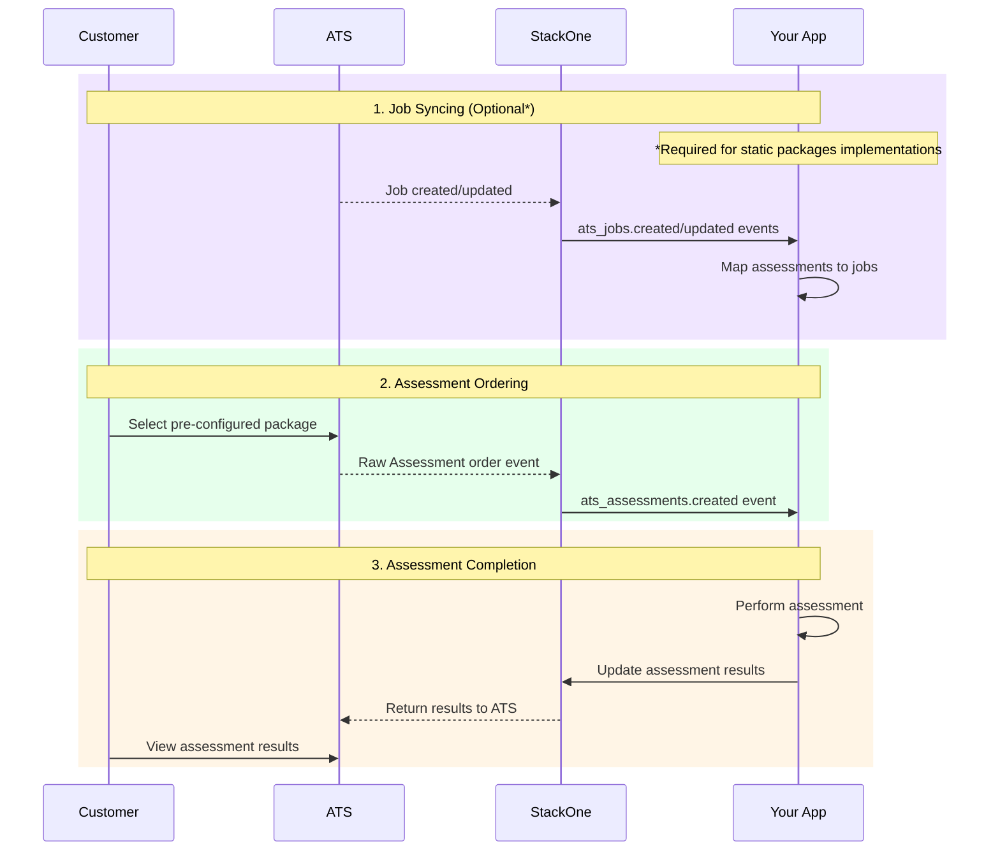
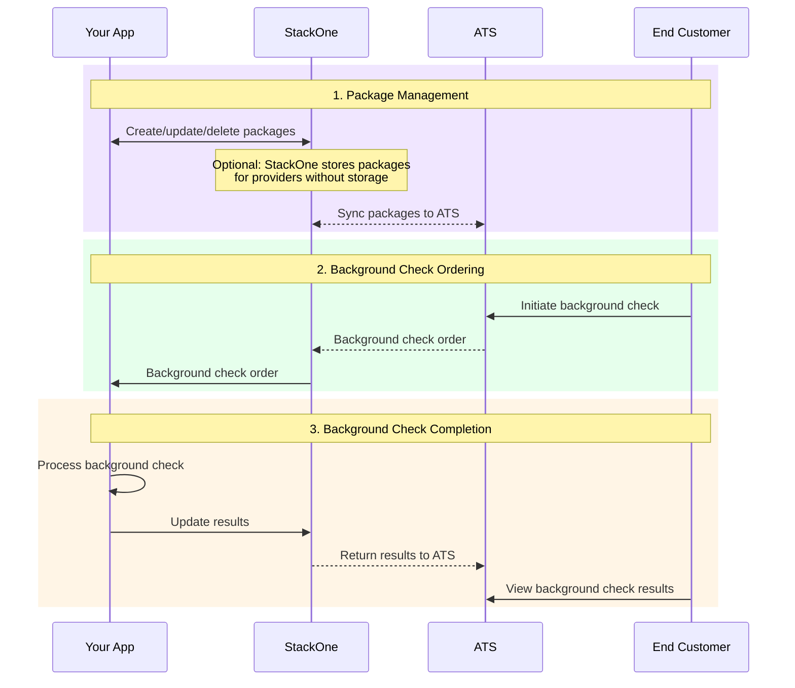

<Frame>
  
</Frame>

As assessment providers, building and maintaining separate integrations for every ATS customer can be tricky, especially as implementation specs tend to differ between ATS providers. Each system requires custom code to sync candidate data, receive test requests, and return results.

StackOne's Unified ATS API simplifies this with unified Assessment endpoints and webhooks. Connect once and integrate with Greenhouse, Workday, Lever, and others. No more juggling multiple APIs or dealing with inconsistent data formats.

<ResponseField name="StackOne simplifies all of this by offering:">
  <Expandable title="StackOne Features">
    <ResponseField name="Why StackOne?">
      - **Unified API:** connecting multiple ATS platforms for consistent job and candidate data sync.
      - **Scalable Infrastructure:** Easily onboard additional ATS providers as your hiring needs grow.
      - **Standardized data formats:** Avoid discrepancies across ATS platforms by using standardized data formats.
      - **Real-Time Webhooks:** Automatically sync assessment orders and results, keeping your dashboard always up to date.
    </ResponseField>
  </Expandable>
</ResponseField>

## Integrating Candidate Assessments Intelligence in Your SaaS: Key Steps and System Interactions

Integrating assessments into your SaaS involves syncing with multiple ATS providers, retrieving job and candidate data, and managing assessments such as coding tests or psychometric evaluations. This enables HR teams to assign, track, and evaluate candidate assessments based on specific job requirements, simplifying the hiring process.

## Implementation Approaches for Different ATS Systems

Different ATS systems have varying capabilities for handling assessment packages. StackOne provides flexible implementation approaches to accommodate these differences:

1. **Standard Implementation** - For most ATS systems with dynamic package capabilities such as [Greenhouse](/integration-configuration-concepts/ats/greenhouse-assessment-background-check), [Ashby](/integration-configuration-concepts/ats/ashby-background-check), [Teamtailor](/integration-configuration-concepts/ats/teamtailor-assessment-or-background-check), etc.
2. **Static Packages Implementation** - For systems like [Workday](/integration-configuration-concepts/ats/workday-assessment) or [SAP SuccessFactors](/integration-configuration-concepts/ats/sapsuccessfactors-assessment) that require manual package creation
3. **Management of Packages via CRUD Operations** - Specific approach for handling background checks through StackOne APIs

Let's explore each approach with its specific workflow:

## Standard Implementation (Dynamic Package List)

This implementation works with most ATS systems that support dynamic package retrieval.

<Info>
  **Partnership Required**: To implement this standard approach, you'll need to establish a partnership with the ATS provider (such as Greenhouse, Lever, etc.). StackOne can help facilitate this process, but the partnership agreement is ultimately between you and the ATS provider. This partnership ensures proper API access and configuration for retrieving assessment packages from your endpoint.
</Info>

<Note>
  For platform-specific configuration details on standard implementations, refer to our hub documentation:

  - [Greenhouse Assessment](/integration-configuration-concepts/ats/greenhouse-assessment-background-check)
  - [Ashby Assessment](/integration-configuration-concepts/ats/ashby-background-check)
  - [Teamtailor Assessment](/integration-configuration-concepts/ats/teamtailor-assessment-or-background-check)
</Note>

<Steps>
  <Step title="Provide Assessment Packages to StackOne">
    **Implement a packages endpoint:** Create an endpoint that matches StackOne's list packages documentation. When an end customer takes action in their ATS, the ATS will request assessment packages from StackOne, which will then fetch the tests from your endpoint.

    - **Your Endpoint:** Must conform to [`GET /ats/assessments/packages`](/ats/api-reference/assessments/packages/list-assessments-packages) structure

    **Return available packages:** Your endpoint should return a list of assessment packages that are available for the customer to select from.
  </Step>
  <Step title="End Customer Selects a Package in ATS">
    **Package selection:** The end customer selects an assessment package through their ATS interface for a specific candidate and job.

    **Automated triggering:** Alternatively, this can be an automated process if the ATS allows configuration of a specific package for a particular stage in the hiring process.
  </Step>
  <Step title="Receive Assessment Order Notifications">
    **Subscribe to assessment webhooks:** Set up a webhook subscription to receive notifications when new assessment orders are created.

    - **Webhook Event:** `ats_assessments.created`
    - **Webhook Configuration:** Configure at [StackOne Webhooks](https://app.stackone.com/webhooks)

    **Use application and candidate information:** The webhook payload contains application_id and candidate_id references that you can use to retrieve detailed information.

    - Access candidate details: [`GET /ats/candidates/{id}`](/ats/api-reference/candidates/get-candidate)
    - Access application details: [`GET /ats/applications/{id}`](/ats/api-reference/applications/get-application)
    - If needed, access job details: [`GET /ats/jobs/{id}`](/ats/api-reference/jobs/get-job) using the job_id from the application

    **Access job and candidate data:** These resources contain all the information needed to process the assessment order.

    **Fetch assessment order details:** Once you receive the webhook notification, you can fetch additional details about the assessment order.
  </Step>
  <Step title="Perform Assessment and Return Results">
    **Reach out to candidate:** Using the candidate data from the assessment order, communicate with the candidate to perform the assessment.

    **Process assessment results:** Once the candidate completes the assessment, process and analyze the results.

    **Return results to ATS:** Send the assessment results back to the ATS through StackOne's unified API.

    - **API Endpoint:** [`PATCH /ats/assessments/orders/{id}/result`](/ats/api-reference/assessments/results/update-assessments-result)
  </Step>
</Steps>

## Static Packages Implementation (eg. Workday)

For ATS systems that use static packages (like [Workday](/integration-configuration-concepts/ats/workday-assessment) or [SAP SuccessFactors](/integration-configuration-concepts/ats/sapsuccessfactors-assessment)), a different approach is needed.

<Note>
  For platform-specific configuration details on static packages implementations, refer to our hub documentation:

  - [SAP SuccessFactors Assessment](/integration-configuration-concepts/ats/sapsuccessfactors-assessment)
  - [Workday Assessment](/integration-configuration-concepts/ats/workday-assessment)
</Note>

<Steps>
  <Step title="Manual Package Creation in the ATS">
    **Create assessment categories:** Navigate to the assessment categories management section in your ATS and create a new assessment category (e.g., "Technical Assessment Test").

    **Create assessment tests:** Navigate to the assessment tests management section and create a new assessment test linked to the category and the integration system (e.g., "Technical Assessment").

    **Note the Assessment Test ID:** This ID (e.g., "RECRUITING_ASSESSMENT_TEST-6-111") will be needed for notification payload configurations.
  </Step>
  <Step title="Sync and Map Jobs (Optional)">
    **Subscribe to job events:** Set up webhooks to receive notifications when jobs are created or updated.

    - **Webhook Event:** `ats_jobs.created` and `ats_jobs.updated`

    **Retrieve all active jobs:** Initially fetch all active jobs and store them in your system.

    - **API Endpoint:** [`GET /ats/job_postings`](/ats/api-reference/job-postings/list-job-postings)

    **Create mapping interface:** Build an interface in your SaaS that allows customers to map specific assessment packages to job types or individual job postings.

    **Store mapping data:** Maintain a database of the mappings between assessment packages and job postings.
  </Step>
  <Step title="Receive and Process Assessment Orders">
    **Receive assessment order webhook:** Get notified when a new assessment order is created.

    - **Webhook Event:** `ats_assessments.created`
    - **Webhook Configuration:** Configure at [StackOne Webhooks](https://app.stackone.com/webhooks)

    **Use application and candidate information:** The webhook payload contains application_id and candidate_id references that you can use to retrieve detailed information.

    - Access candidate details: [`GET /ats/candidates/{id}`](/ats/api-reference/candidates/get-candidate)
    - Access application details: [`GET /ats/applications/{id}`](/ats/api-reference/applications/get-application)
    - If needed, access job details: [`GET /ats/jobs/{id}`](/ats/api-reference/jobs/get-job) using the job_id from the application

    **Access job and candidate data:** These resources contain all the information needed to process the assessment order.

    **Fetch full order details:** Access complete information about the assessment order.
  </Step>
  <Step title="Return Assessment Results">
    **Collect assessment results:** Gather the results of the completed assessment.

    **Update the ATS with results:** Send the assessment results back to the ATS through StackOne.

    - **API Endpoint:** [`PATCH /ats/assessments/orders/{id}/result`](/ats/api-reference/assessments/results/update-assessments-result)
  </Step>
</Steps>

## Management of Packages via CRUD Operations (Background Checks Only)

This approach is **specifically designed for background check integrations** with ATS systems like [Workday Background Check](/integration-configuration-concepts/ats/workday-background-check), where a different approach from standard assessments is required.

<Info>
  **StackOne Package Storage:** For ATS systems that support dynamic fetching but lack proper CRUD operations support, StackOne will store and manage the background check packages. This provides a unified approach whether the underlying ATS supports package storage or not.
</Info>

<Steps>
  <Step title="Create Background Check Packages">
    **Create background check packages programmatically:** Instead of implementing a list endpoint, create packages programmatically using StackOne's unified API CRUD operations.

    - **API Endpoint:** [`POST /ats/background_checks/packages`](/ats/api-reference/background-checks/packages/create-background-check-package)

    **Configure Background Check Business Process:** Update the Integration System and Document Delivery settings in your ATS's Background Check Business Process.
  </Step>
  <Step title="Manage Background Check Packages">
    **Update existing packages:** Modify background check packages as needed using StackOne APIs.

    - **API Endpoint:** [`PATCH /ats/background_checks/packages/{id}`](/ats/api-reference/background-checks/packages/update-background-check-package)

    **Remove unwanted packages:** Delete packages that are no longer needed.

    - **API Endpoint:** [`DELETE /ats/background_checks/packages/{id}`](/ats/api-reference/background-checks/packages/delete-background-check-package)
  </Step>
  <Step title="Receive Background Check Orders">
    **Subscribe to background check webhooks:** Configure webhooks to receive notifications when new background check orders are created.

    - **Webhook Event:** `background_check_order.created`
    - **Webhook Configuration:** Configure at [StackOne Webhooks](https://app.stackone.com/webhooks)

    **Use application and candidate information:** The webhook payload contains application_id and candidate_id references that you can use to retrieve detailed information.

    - Access candidate details: [`GET /ats/candidates/{id}`](/ats/api-reference/candidates/get-candidate)
    - Access application details: [`GET /ats/applications/{id}`](/ats/api-reference/applications/get-application)

    **Fetch order details:** Access complete information about the background check order if needed.
  </Step>
  <Step title="Return Background Check Results">
    **Return background check results:** Send the results back through StackOne's unified API.

    - **API Endpoint:** [`PATCH /ats/background_checks/orders/{id}/result`](/ats/api-reference/background-checks/results/update-background-check-result)
  </Step>
</Steps>

## Frequently Asked Questions

### General Implementation Questions

<Accordion title="How do I choose between the different implementation approaches?">
  Your choice depends on the ATS systems your customers use:

  - Use the **Standard Implementation** for ATS systems with dynamic package capabilities (Greenhouse, Lever, etc.)
  - Use the **Static Packages Implementation** for systems like Workday or SAP SuccessFactors
  - Use the **Management of Packages via CRUD Operations** specifically for background checks

  If you support multiple ATS systems, you may need to implement multiple approaches.
</Accordion>

<Accordion title="What partnership requirements exist for implementing assessments with StackOne?">
  To implement assessments via the StackOne unified API, you'll need to:

  1. Establish a formal partnership with the ATS (in instances where a partnership is required by the ATS)
  2. Set up a packages endpoint that conforms to our API specifications
  3. Deploy webhooks to receive assessment orders
  4. Configure your assessment delivery mechanism
  5. Implement result reporting back to the ATS

  _Contact StackOne to learn more about which ATS providers require partnerships in order to integrate with their Assessments flow, plus howStackOne can help facilitate ATS provider partnerships and support you in the application process._
</Accordion>

<Accordion title="What's the typical timeline for implementing an assessment integration?">
  Implementation timelines vary based on complexity:

  - Standard implementation: 2-4 weeks
  - Static packages implementation: 3-6 weeks
  - Background check implementation: 3-6 weeks

  Factors affecting timeline include your existing infrastructure, familiarity with our API, and specific ATS requirements.
</Accordion>

### Technical Questions

<Accordion title="How do webhooks work with the assessment flow?">
  Webhooks provide real-time notifications when assessment-related events occur:

  1. Subscribe to relevant events like `ats_assessments.created`
  2. StackOne sends a notification to your endpoint when these events occur
  3. Your application processes the webhook payload and takes appropriate action
  4. You can fetch additional details using the IDs provided in the webhook payload

  See our [Webhooks documentation](/legacy-unified-apis/common-guide/webhooks) for detailed setup instructions.
</Accordion>

<Accordion title="Can I map specific assessment types to different job roles?">
  Yes, you can implement job-to-assessment mapping in two ways:

  **For Standard Implementation:**

  - Return different assessment packages based on job attributes when your packages endpoint is called

  **For Static Packages Implementation:**

  - Create a custom UI in your application allowing customers to map job types to specific assessment packages
  - Store these mappings and use them when you receive assessment order webhooks

  This mapping functionality allows customers to automatically assign appropriate assessments based on job requirements.
</Accordion>

<Accordion title="How do I handle security and compliance in assessment integrations?">
  Security best practices for assessment integrations include:

  1. **Secure Authentication**: Use HTTPS for all endpoints and implement secure authentication
  2. **Webhook Verification**: Validate webhook signatures using StackOne's signing secret
</Accordion>

<Accordion title="Can I implement multiple assessment vendors for the same ATS?">
  Yes, you can integrate multiple assessment vendors with the same ATS through StackOne. This provides customers with flexibility to choose different assessment types from various vendors.

  When implementing multiple vendors:

  1. Each vendor should have their own packages endpoint
  2. Each vendor receives their own assessment order webhooks
  3. Results are pushed back to the ATS through the same unified API

  This approach allows customers to use specialized assessments from different providers while maintaining a consistent integration.
</Accordion>

### Troubleshooting

<Accordion title="What should I do if assessment order webhooks aren't being received?">
  If you're not receiving assessment order webhooks:

  1. Verify webhook subscription is correctly configured in the [StackOne dashboard](https://app.stackone.com/webhooks)
  2. Check that you're subscribed to the correct event types (`ats_assessments.created`)
  3. Ensure your webhook endpoint is publicly accessible and responding with 200 status codes
  4. Review the webhook health in the StackOne dashboard
  5. Test your endpoint with StackOne's webhook testing tools

  Contact [StackOne support](mailto:support@stackone.com) if issues persist.
</Accordion>

<Accordion title="How do I debug assessment result submission issues?">
  If you encounter problems when submitting assessment results:

  1. Verify you're using the correct endpoint format: [`PATCH /ats/assessments/orders/{id}/result`](/ats/api-reference/assessments/results/update-assessments-result)
  2. Ensure your payload conforms to the expected schema
  3. Check that you're using the correct assessment order ID
  4. Confirm your authentication is valid
  5. Review the API response for specific error details

  You can test submissions with sample data before implementing in production.
</Accordion>

## Frequently Asked Questions
