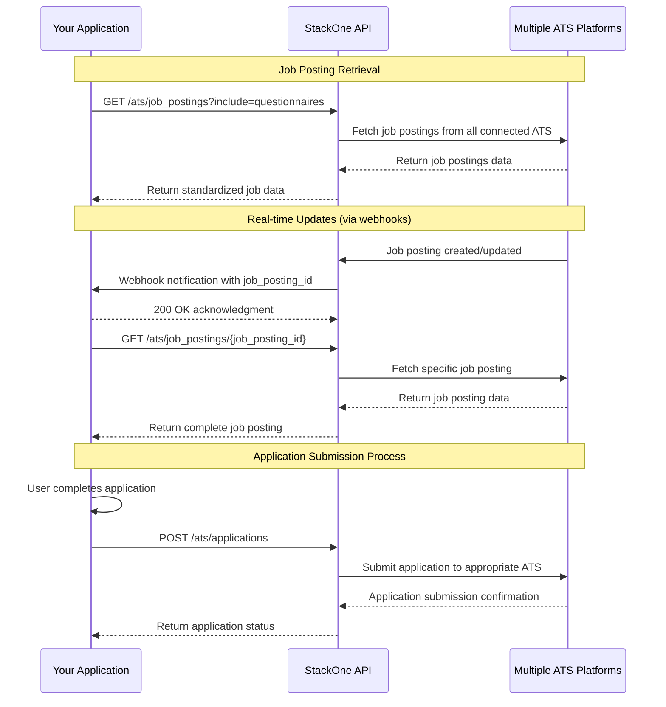

<Frame>
  
</Frame>

Imagine you're building a job board that needs to pull listings from multiple ATS platforms like Greenhouse, Ashby, and Workday. Each platform has its own API and data format, requiring custom code and constant maintenance.

As integrations grow, so does complexity, leading to a fragile and time-consuming system.

Managing these integrations can quickly become a burden, consuming valuable time and resources. Without a unified solution, you’re likely to face:

- Repetitive and tedious coding for each ATS, making the integration process time-consuming and error-prone.
- Ongoing maintenance burdens as you try to keep all integrations functional with every API update.
- Frustration with traditional iPaaS solutions that are complex to implement and come with high costs.

<Card title="StackOne simplifies all of this by offering:" icon="square-terminal" iconType="duotone">
  - A unified API that allows you to connect to multiple ATS platforms with minimal effort.
  - Consistent data formats across all integrations, reducing the need for custom code.
  - Scalability that lets you easily add new ATS platforms as your needs grow.
</Card>

With StackOne, you can move beyond the grind of manual integrations and focus on building the features that truly matter.

## Integrating ATS Platforms: Key Steps and System Interactions for Your Job Board

When building your job board, you'll need to display jobs and manage applications from various ATS providers like Greenhouse, Ashby, and others. To simplify this process, we will be using StackOne's ATS endpoints to integrate and synchronize data across multiple platforms.

The diagram below shows the sequence of API calls: from user engagement on your job board, to retrieving job listings and application data from ATS providers.

### Steps to Building a Job Board Using StackOne

When building a job board that integrates with multiple ATS platforms there are several steps involved. Each step corresponds to a specific operation within StackOne, which handles the necessary API interactions to fetch, display, and manage job listings and applications. Below are the steps needed to create a functional job board using StackOne.

<Steps>
  <Step title="Retrieve Job Postings" stepNumber={1}>
    This endpoint retrieves all available job postings from the selected ATS platforms, standardizing the data format so you can easily display listings regardless of their source. By adding the `include=questionnaires` parameter, you'll also receive any screening questions that need to be answered during the application process.

    - API endpoint: [GET /ats/job_postings](/ats/api-reference/job-postings/list-job-postings)
  </Step>
  <Step title="Configure Webhooks for Real-Time Job Updates" stepNumber={2}>
    Set up webhooks to receive notifications when job postings are created, updated, or deleted, ensuring your application stays synchronized with the ATS platform's.
  </Step>
  <Step title="Submit Job Applications with Questionnaire Responses" stepNumber={3}>
    When candidates complete applications in your system, submit their information back to the appropriate ATS platform, including any questionnaire responses.

    This endpoint handles the complexity of formatting and submitting applications to different ATS platforms, ensuring candidates' information is properly recorded in the employer's system.

    - API endpoint: [POST /ats/applications](/ats/api-reference/applications/create-application)
  </Step>
</Steps>

## Conclusion

In this walkthrough, we explored the process of creating a job board that integrates with multiple ATS platforms like Greenhouse and Ashby. By using StackOne's unified API, we minimized the effort required to connect these systems. StackOne simplified the integration process, enabling us to manage jobs and applications across various platforms without the need for custom coding or extensive maintenance.
