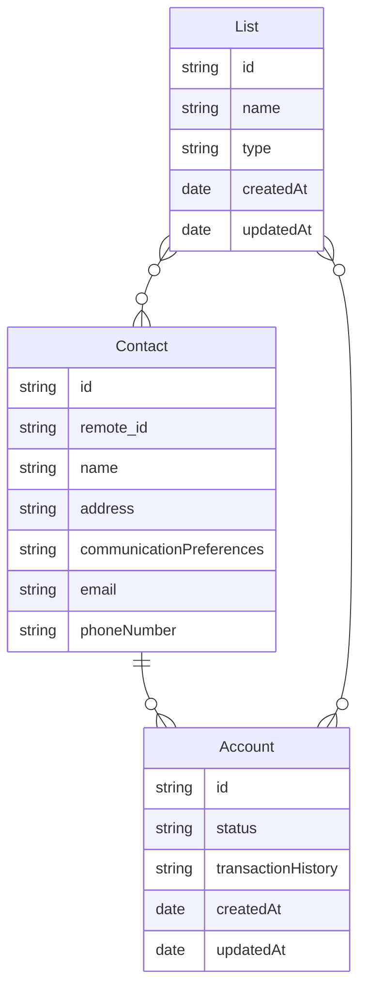

import LegacyUnifiedApisNotice from "/snippets/legacy-unified-apis-notice.mdx";
import sdkOpenApiSection from "/snippets/sdk-open-api-section.mdx";
import sdkPageRedirect from "/snippets/sdk-page-redirect.mdx";
import UnifiedApiPrimer from "/snippets/unified-api-primer.mdx";

<LegacyUnifiedApisNotice />

<UnifiedApiPrimer />

## Benefits of the CRM API

<AccordionGroup>
  <Accordion title="Unified Contact and Account Management" defaultOpen={false}>
    Manage customer contacts and accounts through a single standardized API, regardless of the underlying CRM platforms, ensuring a consistent view of customer data.
  </Accordion>

  <Accordion title="Real-Time Data Synchronization">
    StackOne's APIs support real-time data polling, allowing for immediate updates and synchronization across platforms.
  </Accordion>

  <Accordion title="Privacy-First Design Ensuring Compliance">
    With a [focus on security](https://www.stackone.com/blog/why-your-choice-of-unified-api-could-make-or-break-compliance), StackOne's architecture avoids unnecessary data storage, maintaining compliance with data protection regulations.
  </Accordion>

  <Accordion title="Synthetic and Native Webhooks for Updates">
    The platform provides both [synthetic and native webhooks](/legacy-unified-apis/common-guide/webhooks), enabling real-time notifications for customer and opportunity changes.
  </Accordion>

</AccordionGroup>

## Key Features

The table below shows key features of the CRM API that make customer relationship management easier, from real-time contact tracking to opportunity management:

| **Feature**                      | **Description**                                                                                                        |
| -------------------------------- | ---------------------------------------------------------------------------------------------------------------------- |
| Comprehensive Contact Management | Easily create, update, and retrieve customer profiles, including contact details, interaction history, and engagement. |
| Real-Time Data Synchronization   | Ensure that customer information, sales opportunities, and interactions are updated across systems instantly.          |
| Real-Time Webhooks               | Receive instant notifications for changes in customer profiles, opportunities, or lead statuses.                       |

## StackOne SDKs & OpenAPI Specification

<sdkPageRedirect />
<CardGroup cols={2}>
  <Card title="OpenAPI Specification" icon="link" href="https://api.eu1.stackone.com/oas/crm.json" arrow="true" cta="Click here"/>
  <sdkOpenApiSection />
</CardGroup>

## Entity Model and Relationships

The following diagram illustrates the key entities within the CRM API:

The following table outlines key entities within the CRM system and provides a brief description of each.

| Entity   | Description                                                                                                              |
| -------- | ------------------------------------------------------------------------------------------------------------------------ |
| Contacts | Manages individual contact details, including names, addresses, and communication preferences.                           |
| Accounts | Handles organizational accounts, encompassing details like account status, associated contacts, and transaction history. |
| Lists    | Manage your custom data lists across your service providers.                                                             |
