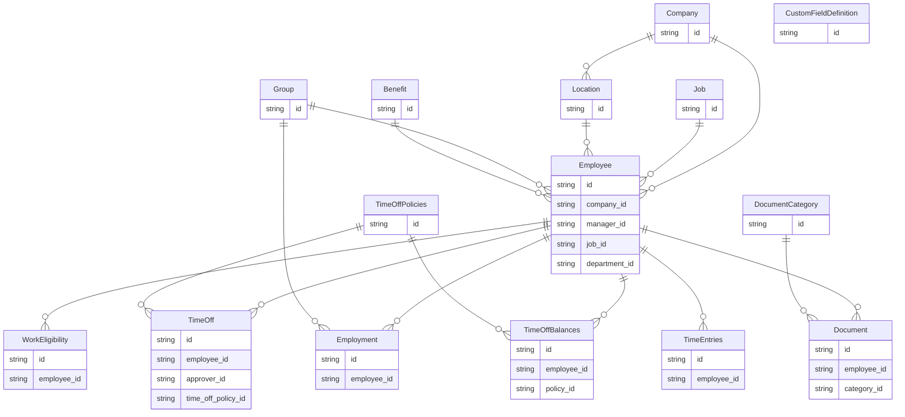

import LegacyUnifiedApisNotice from "/snippets/legacy-unified-apis-notice.mdx";
import sdkOpenApiSection from "/snippets/sdk-open-api-section.mdx";
import sdkPageRedirect from "/snippets/sdk-page-redirect.mdx";
import UnifiedApiPrimer from "/snippets/unified-api-primer.mdx";

<LegacyUnifiedApisNotice />

<UnifiedApiPrimer />

## Benefits of the HRIS API

<AccordionGroup>
  <Accordion title="Real-Time Data Synchronization">
    StackOne's APIs support real-time data polling, allowing for immediate updates and synchronization across platforms.
  </Accordion>

  <Accordion title="Privacy-First Design Ensuring Compliance">
    With a [focus on security](https://www.stackone.com/blog/why-your-choice-of-unified-api-could-make-or-break-compliance), StackOne's architecture avoids unnecessary data storage, maintaining compliance with data protection regulations.
  </Accordion>

  <Accordion title="Synthetic and Native Webhooks for Updates">
    The platform provides both [synthetic and native webhooks](/legacy-unified-apis/common-guide/webhooks), enabling real-time notifications for employee and payroll changes.
  </Accordion>

  <Accordion title="Comprehensive HRIS Integration Coverage">
    StackOne offers [pre-built connectors](https://www.stackone.com/integrations) with a wide range of HRIS platforms, simplifying the integration process.
  </Accordion>

</AccordionGroup>

## Key Features

The table below shows key features of the HRIS API that make human resources management easier, from real-time employee tracking to payroll management:

| **Feature**                         | **Description**                                                                                               |
| ----------------------------------- | ------------------------------------------------------------------------------------------------------------- |
| Comprehensive Employee Management   | Easily create, update, and retrieve employee profiles, including personal information and employment history. |
| Payroll and Compensation Management | Manage payroll data, track compensation ranges, and update salary information for employees.                  |
| Leave and Attendance Tracking       | Monitor and update employee attendance, time-off requests, and manage leave balances.                         |
| Real-Time Webhooks                  | Receive instant notifications for changes in employee profiles, payroll, or leave data.                       |
| Document Management                 | Upload, download, and manage employee documents such as contracts and performance reviews.                    |
| Benefits Management                 | Record and manage employee benefits, including health, retirement, and wellness programs.                     |
| Employee Onboarding and Offboarding | Handle employee onboarding, document signing, and offboarding processes, tracking key milestones.             |

## StackOne SDKs & OpenAPI Specification

<sdkPageRedirect />
<CardGroup cols={2}>
  <Card title="OpenAPI Specification" icon="link" href="https://api.eu1.stackone.com/oas/hris.json" arrow="true" cta="Click here"/>
  <sdkOpenApiSection />
</CardGroup>

## Entity Model and Relationships

The following diagram illustrates the key entities within the HRIS API:

The following table outlines key entities within the HRIS system and provides a brief description of each.

| Entity            | Description                                                                                                                                        |
| ----------------- | -------------------------------------------------------------------------------------------------------------------------------------------------- |
| Companies         | Represents the high-level organizational details of companies present in the underlying system, such as name, display name, and other identifiers. |
| Employees         | Contains comprehensive information about employees, including personal details, contact information, and relationship to other entities.           |
| Employments       | Details the employment records of each employee including job positions, start and end dates, compensation details, and more.                      |
| Locations         | Manages information about the work locations. Location may contain a name associated contact details.                                              |
| Time Off          | Manages records of employee leave requests and their approval status, including request type, duration, and related policies.                      |
| Time Off Balances | Tracks the available balance of time off for employees according to specific policies.                                                             |
| Time Off Policies | Defines the policies governing time off requests, including types of leave, duration units, and associated reasons.                                |
| Benefits          | Manages information about employee benefits programs, providers, and descriptions.                                                                 |
| Groups            | Organizes employees into logical groupings such as departments, teams, and cost centers.                                                           |
| Jobs              | Represents job positions available within the organization, including titles and statuses.                                                         |
| Time Entries      | Records employee work time entries, including start and end times, breaks, and status.                                                             |
| Work Eligibility  | Tracks employee work authorization documents such as visas, passports, and other legal identification.                                             |
| Documents         | Manages employee-related documentation including personal identification, contracts, and administrative forms.                                     |
| Skills            | Represents employee professional skills, proficiency levels, and related attributes.                                                               |

## Use cases

<CardGroup cols={3}>
  <Card title="User Syncing" href="/hris/use-cases/sync-users">
    Ensure your system is up to date with all the employees details in your customers' HRIS system.&#x20;
  </Card>

  <Card title="Automated Employee Provisioning" href="/hris/use-cases/employee-provisioning">
    After the recruitment process, automate the provisioning and management of employees in your customer's HRIS system.
  </Card>
</CardGroup>
