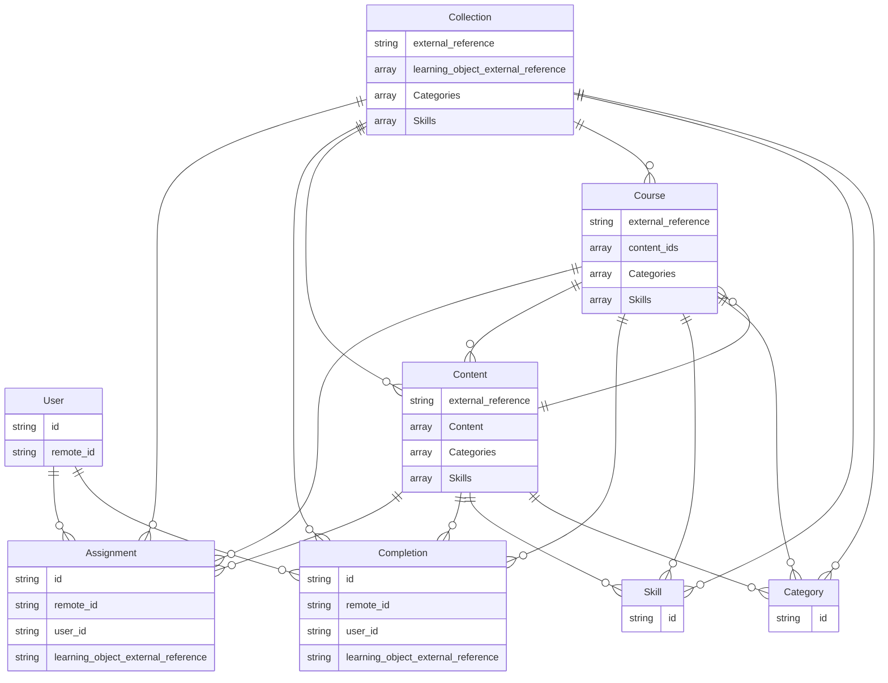

import LegacyUnifiedApisNotice from "/snippets/legacy-unified-apis-notice.mdx";
import sdkOpenApiSection from "/snippets/sdk-open-api-section.mdx";
import sdkPageRedirect from "/snippets/sdk-page-redirect.mdx";
import UnifiedApiPrimer from "/snippets/unified-api-primer.mdx";

<LegacyUnifiedApisNotice />

<UnifiedApiPrimer />

## Benefits of the LMS API

<AccordionGroup>
  <Accordion title="Real-Time Data Synchronization">
    StackOne's APIs support real-time data polling, allowing for immediate updates and synchronization across platforms.
  </Accordion>

  <Accordion title="Privacy-First Design Ensuring Compliance">
    With a [focus on security](https://www.stackone.com/blog/why-your-choice-of-unified-api-could-make-or-break-compliance), StackOne's architecture avoids unnecessary data storage, maintaining compliance with data protection regulations.
  </Accordion>

  <Accordion title="Synthetic and Native Webhooks for Updates">
    The platform provides both [synthetic and native webhooks](/legacy-unified-apis/common-guide/webhooks), enabling real-time notifications for course updates and user progress tracking.
  </Accordion>

  <Accordion title="Comprehensive LMS Integration Coverage">
    StackOne offers [pre-built connectors](https://www.stackone.com/integrations) with a wide range of LMS platforms, simplifying the integration process.
  </Accordion>

</AccordionGroup>

## Key Features

The table below highlights key features of the LMS API that enhance learning and content management:

| **Feature**             | **Description**                                                                                                           |    |
| ----------------------- | ------------------------------------------------------------------------------------------------------------------------- | :- |
| Comprehensive User Sync | Synchronize users data across LMS, HRIS and other platforms, including skills, activity and learning.                     |    |
| Course Management       | List and manage courses, access detailed descriptions, metadata, and learning objectives.                                 |    |
| Content Management      | Create, organize, and manage educational materials like videos, quizzes, and documents across multiple courses.           |    |
| Real-Time Webhooks      | Receive instant notifications for changes in data such as user progress, course updates, or content modifications.        |    |
| Assignment Tracking     | Monitor and manage user assignments, statuses, and progress across various courses.                                       |    |
| Progress Tracking       | Track user progress, completion statuses, and award certificates upon completion.                                         |    |
| Category Management     | Organize courses into categories for easy discovery and retrieval based on themes or topics.                              |    |
| Skills Management       | Enhanced skills tracking across jobs, users and learning content to help embed skills first people management more deeply |    |

## StackOne SDKs & OpenAPI Specification

<sdkPageRedirect />
<CardGroup cols={2}>
  <Card title="OpenAPI Specification" icon="link" href="https://api.eu1.stackone.com/oas/lms.json" arrow="true" cta="Click here"/>
  <sdkOpenApiSection />
</CardGroup>

## Entity Model and Relationships

The following diagram illustrates the key entities within the LMS API:

The following table outlines the key entities within the LMS system represented in the diagram and provides a brief description of each:

| Entity     | Description                                                                                                                                                                                     |
| ---------- | ----------------------------------------------------------------------------------------------------------------------------------------------------------------------------------------------- |
| User       | Represents an individual interacting with the LMS, encompassing attributes like unique identifiers, personal information, and roles within the system.                                          |
| Course     | Denotes a structured learning program, including details such as course ID, title, description, duration, and associated metadata.                                                              |
| Content    | Refers to the educational materials within a course, which can include various types such as videos, articles, quizzes, and documents, each with specific attributes like content type and URL. |
| Assignment | Represents tasks or activities assigned to users within a course, including details like due dates, instructions, and submission requirements.                                                  |
| Completion | Records the completion status of courses or modules by users, capturing information such as completion dates, scores, and certificates awarded.                                                 |
| Category   | Classifies courses into different groups or subjects, aiding in the organization and retrieval of courses based on topics or themes.                                                            |
| Skills     | Identifies key skills for content and users to help identify skills gaps and provide tailored content suggestions                                                                               |
