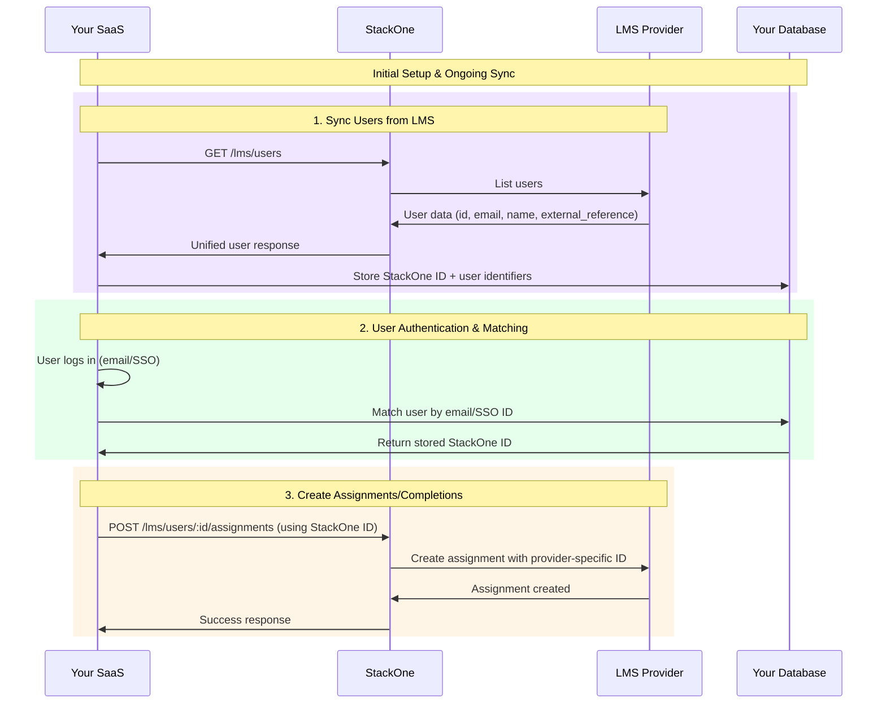
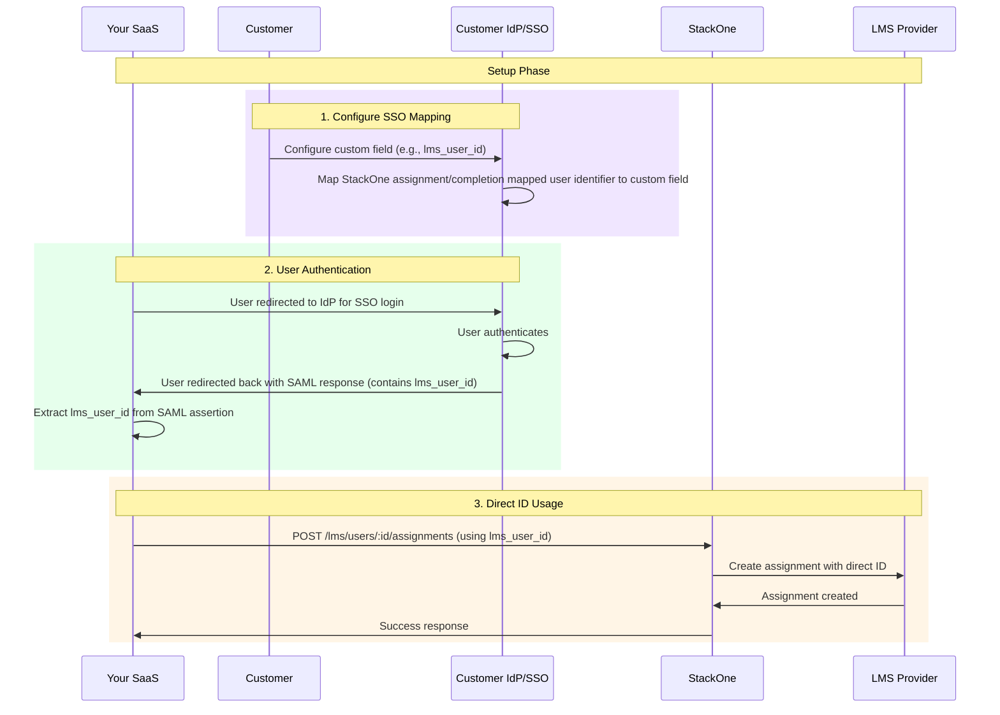

## Overview

There are two main approaches for handling user identification and matching in LMS integrations:

## Approach 1: List Users and Store Data

You provision users into your database and match your identifier (email/SSO ID) with the user metadata. Store the StackOne ID and use this in the URL of the User Assignments/Completions request.

**Benefits:**
- Minimal SSO configuration specifications
- Complete user data available
- Reliable user identification across sessions
- Better tracking and analytics capabilities

**Drawbacks:**
- Storing lots of user data
- Requires regular synchronization
- Higher storage requirements

## Approach 2: SSO Identifier Alignment

Both you and your customer align on SSO identifiers using the StackOne docs. You map this to a reusable specific custom field and use this as the ID in the user completions/assignments requests.

**Documentation Examples:**
- [Your docs](/integration-guides/lms/external-content-providers/sap#sso-configuration-for-completion-creation)
- [Customer docs](/connection-guides/lms/sapsuccessfactors#sso-configuration)

**Benefits:**
- Minimal data storage requirements
- Direct SSO integration
- Real-time user identification
- No need for user data synchronization

**Drawbacks:**
- Requires customer SSO configuration
- More complex initial setup
- Dependency on customer's IdP configuration

### General Flow for Approach 2:

1. **Provider-Specific ID Required**: There will be a specific ID required by the provider for creating completions
2. **Customer SSO Configuration**: Your customer must configure this to an ID value in their IdP/SSO (e.g., `lms_user_id`)
3. **ID Mapping**: You must map this value and pass it in as the user ID in the URL

---

## User Matching Flow Diagrams

### Approach 1: List Users and Store Data

### Approach 2: SSO Identifier Alignment

---

## Authentication Considerations

### SAML/SSO Support Scenarios

**Scenario 1: LMS/IDP Supports SAML 2.0 SSO**
- LMS acts as Identity Provider (IdP)
- Users redirected with SAML assertion
- Application receives SSO ID for identification
- Smoothest user experience with single sign-on

**Scenario 2: LMS Doesn't Support SAML/SSO & Customer doesn't have IDP**
- Users authenticate directly with your application
- Fallback authentication methods required:
  - Email and password authentication
  - Social login (Google/Microsoft)
- Additional user provisioning strategies needed

### User Provisioning Strategy

To ensure reliable identification across any LMS platform:
- Support multiple authentication flows simultaneously
- Store required identifiers for matching (SSO ID, email, external references)
- Implement fallback authentication when SAML unavailable

---