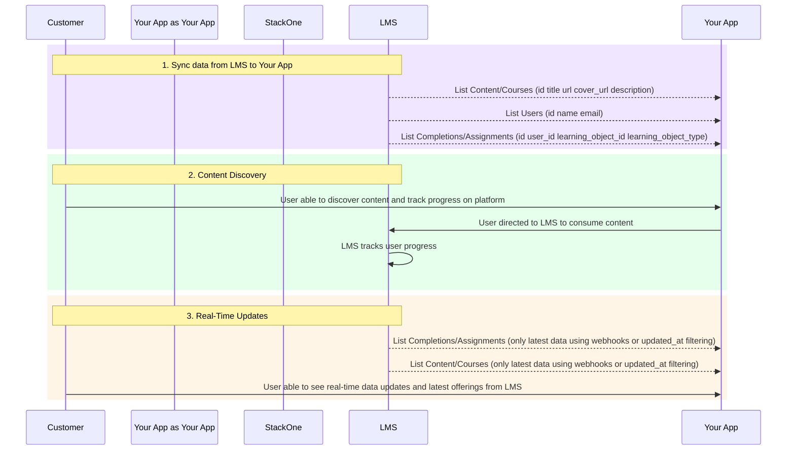

<Frame>

</Frame>

As an LXP/LMS Content Aggregator, you face the challenge of customers using different LMS platforms as their source of truth for learning content. You want to create a centralized learning experience by pulling content from multiple sources, but building individual integrations for each platform is time-consuming and complex.

Each LMS has its own API structure, data formats, and authentication methods. Without a unified solution, aggregating learning content, user data, and progress tracking across different customer systems becomes a significant development burden.

<ResponseField name="StackOne simplifies all of this by offering:">
  <Expandable title="StackOne Features">
    <ResponseField name="Why StackOne?">
      - **Unified API** connecting multiple LMS platforms for content aggregation and user data sync.
      - **Scalability** to easily add new LMS providers as your customer base grows.
      - **Standardized data formats** across LMS platforms for consistent content and user management.
      - **StackOne IDs** for easy matching and referencing of content across platforms.
      - **Updated after filters** to efficiently fetch only the latest changes.
    </ResponseField>
  </Expandable>
</ResponseField>

## LXP/LMS Content Aggregation: Key Steps and System Interactions

Implementing content aggregation for your LXP/LMS platform allows you to pull learning content, user data, and progress tracking from multiple LMS providers through a single, unified API. This enables you to create a centralized learning experience without the complexity of multiple integrations.

### Steps for Content Aggregation and User Sync

Below are the steps to set up comprehensive content aggregation, user provisioning, and progress tracking across multiple LMS platforms.

<Steps>

<Step title="Aggregate Learning Content and Courses">

Start by fetching all available learning content and courses from connected LMS providers. This gives you access to course titles, descriptions, content types, metadata, and learning objects that can be aggregated into your centralized system.

Use the `updated_after` parameter to efficiently sync only recently updated content, reducing API calls and improving performance.

- **API Endpoint**: [GET /lms/content](/lms/api-reference/content/list-content)
- **API Endpoint**: [GET /lms/courses](/lms/api-reference/courses/list-courses)

</Step>

<Step title="Provision Users from Multiple LMS Platforms">

Retrieve user data from all connected LMS platforms to provision users in your aggregated system. This includes user profiles, enrollment data, and unique identifiers that allow you to match users across different platforms.

The StackOne API provides multiple identifier fields to ensure accurate user matching across platforms, including external references commonly used in SSO integrations.

- **API Endpoint**: [GET /lms/users](/lms/api-reference/users/list-users)
- **API Endpoint**: [GET /lms/users?filter[external_reference]='external_reference'](/lms/api-reference/users/list-users)

</Step>

<Step title="Aggregate Completions and Progress Data">

Pull completion data and assignment progress from all connected LMS platforms to create a unified view of learner progress. This includes completion status, results, timestamps, and learning object associations.

Use StackOne IDs to easily match completions with users and content across different platforms, ensuring consistent progress tracking.

- **API Endpoint**: [GET /lms/completions](/lms/api-reference/completions/list-completions)
- **API Endpoint**: [GET /lms/assignments](/lms/api-reference/assignments/list-assignments)
- **API Endpoint**: [GET /lms/users/{id}/assignments](/lms/api-reference/users/assignments/list-user-assignments)

</Step>

<Step title="Sync Categories, Skills, and Metadata">

Retrieve additional metadata like categories, skills, and other taxonomies from connected LMS platforms. This enriches your aggregated content with proper categorization and skill mapping, enabling better content discovery and recommendation systems.

- **API Endpoint**: [GET /lms/categories](/lms/api-reference/categories/list-categories)
- **API Endpoint**: [GET /lms/skills](/lms/api-reference/skills/list-skills)

</Step>

<Step title="Implement Real-Time Updates">

Set up automated sync processes using the `updated_after` filter to regularly fetch only the latest changes from each connected LMS platform. This ensures your aggregated content and user data stay current without overwhelming your system with unnecessary API calls.

Store the last sync timestamp for each LMS provider to efficiently track and update only modified content, users, and progress data.

</Step>

</Steps>

The diagram below illustrates the content aggregation workflow, showing how learning content, user data, and progress tracking are pulled from multiple LMS platforms and unified into a single, comprehensive learning experience.



## Example API Calls

<Tabs>
  <Tab title="curl" label="cURL" default>

```bash
# Fetch learning content from an LMS platform
curl "https://api.stackone.com/unified/lms/content?updated_after=2024-01-01T00:00:00.000Z" \
  -u "$STACKONE_API_KEY:" \
  -H "x-account-id: YOUR_ACCOUNT_ID"

# Retrieve users for provisioning
curl "https://api.stackone.com/unified/lms/users" \
  -u "$STACKONE_API_KEY:" \
  -H "x-account-id: YOUR_ACCOUNT_ID"

# Get completion data for progress tracking
curl "https://api.stackone.com/unified/lms/completions?updated_after=2024-01-01T00:00:00.000Z" \
  -u "$STACKONE_API_KEY:" \
  -H "x-account-id: YOUR_ACCOUNT_ID"
```
  </Tab>
  <Tab title="python" label="Python">

```python
import requests
import json

# Configuration
api_key = "YOUR_API_KEY"
account_id = "YOUR_ACCOUNT_ID"
base_url = "https://api.stackone.com"

headers = {
    "Authorization": f"Bearer {api_key}",
    "x-account-id": account_id
}

# Fetch learning content
content_response = requests.get(
    f"{base_url}/unified/lms/content",
    headers=headers,
    params={"updated_after": "2024-01-01T00:00:00.000Z"}
)

# Retrieve users
users_response = requests.get(
    f"{base_url}/unified/lms/users",
    headers=headers
)

# Get completion data
completions_response = requests.get(
    f"{base_url}/unified/lms/completions",
    headers=headers,
    params={"updated_after": "2024-01-01T00:00:00.000Z"}
)

# Process the aggregated data
content_data = content_response.json()
users_data = users_response.json()
completions_data = completions_response.json()
```
  </Tab>
</Tabs>

---

## Conclusion

This guide demonstrated how to implement comprehensive content aggregation for LXP/LMS platforms using StackOne's unified API. By following these steps, you can efficiently pull learning content, user data, and progress tracking from multiple LMS providers through a single integration.

The key benefits include centralized content management, unified user provisioning, comprehensive progress tracking, and efficient synchronization using updated after filters. This approach significantly reduces development complexity while providing your customers with a unified, aggregated learning experience across all their LMS platforms.