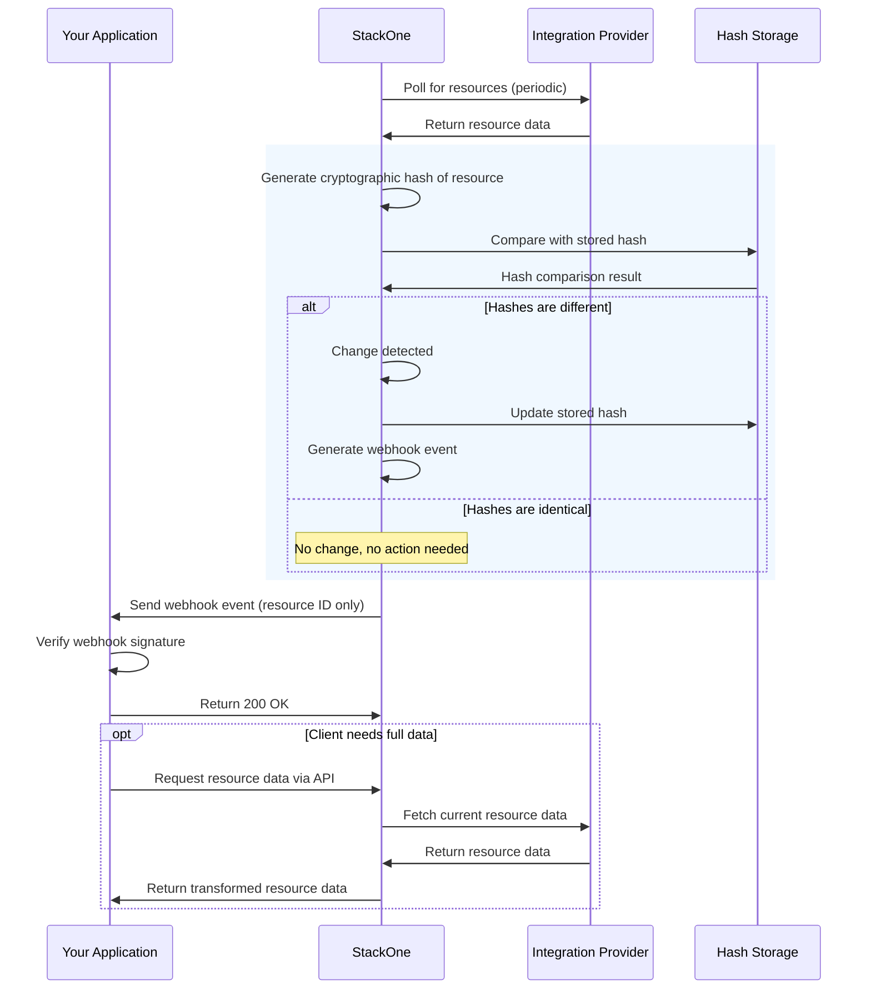
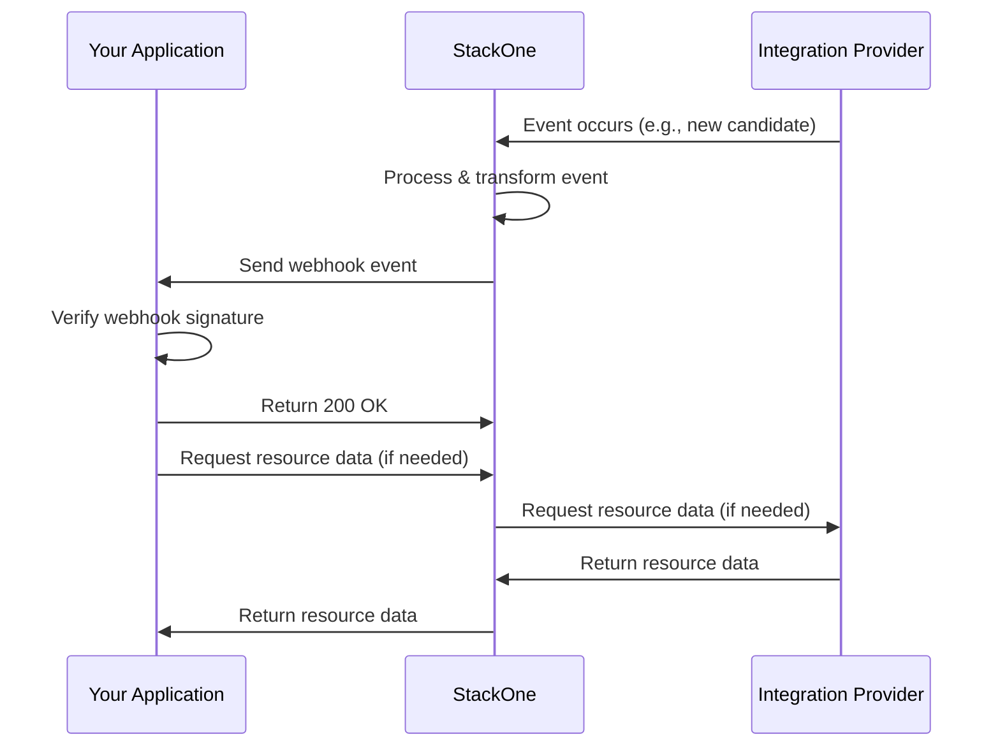

<Info>
**Setting up webhooks today?** Start with the current [Webhook Events](https://docs.stackone.com/connect/webhooks) guide. This page documents behaviour specific to connectors on the **legacy unified APIs** - synthetic events, the unified event catalog, and the unified payload shape with `raw_event` / `event_data`.
</Info>

The general flow for creating a webhook, subscribing to events, verifying signatures, and rotating signing secrets is the same as on the current platform. What's specific to the legacy unified APIs is the **set of events available** and the **shape of the payload you receive**.

## Event types

When you subscribe a webhook to a unified resource, the event can be delivered to you in one of three ways depending on the underlying provider's capabilities.

1. **Programmatic native events** - generated by the underlying provider and mapped to a StackOne unified resource event. When you subscribe, StackOne programmatically creates an event subscription in the provider's system for every currently linked account, and for any future linked account.

2. **Manual native events** - also provider-generated and mapped to a unified resource event, but the provider doesn't expose an API to register subscriptions. StackOne gives you a URL and a secret per linked account, which you (or the account owner) register manually in the provider's admin UI.

3. **Synthetic events** - when a provider has no native webhooks at all, StackOne polls the provider on a schedule and emits an event when it detects a change. Default poll interval is 1 hour, configurable down to 5 minutes where the provider supports time-based filtering.

## How synthetic webhooks work

Synthetic webhooks are generated through intelligent polling and change detection. No PII is stored - only a cryptographic hash of each resource state, so we can detect changes without persisting the underlying data.

<Steps>
  <Step title="Polling">
    StackOne polls the provider for resource updates (default: every 1 hour, configurable down to 5 minutes).
  </Step>
  <Step title="Hashing">
    When data is retrieved, we generate a cryptographic hash of the resource state.
  </Step>
  <Step title="Comparison">
    The new hash is compared with the previously stored hash (not the data itself).
  </Step>
  <Step title="Event generation">
    If hashes differ, a change is detected and a webhook event is generated.
  </Step>
  <Step title="Delivery">
    The webhook event is sent to your application with the resource identifier.
  </Step>
  <Step title="Data retrieval">
    Your application can fetch the full resource data via the API when needed.
  </Step>
</Steps>



## How native webhooks work

Native webhooks (programmatic or manual) flow directly from the provider through StackOne to your endpoint, without polling.



## Event subscription lifecycle

- When a webhook is created, StackOne programmatically creates the relevant event subscriptions in the provider's system for every currently linked account, and for any future linked account.
- When a webhook is deleted, StackOne cleans up those programmatic subscriptions.
- When a webhook is disabled, StackOne stops delivering events to your URL, but the subscriptions in the provider's system remain active.
- When a webhook is enabled, delivery resumes.

## Unified event catalog

These are the events emitted across the legacy unified APIs. The `event` value follows the pattern `<resource>.<action>`.

| Category  | Resource     | Events                                                                                  |
| --------- | ------------ | --------------------------------------------------------------------------------------- |
| Accounts  | Accounts     | `account.created`, `account.updated`, `account.deleted`                                 |
| HRIS      | Employees    | `hris_employees.created`, `hris_employees.updated`, `hris_employees.deleted`            |
|           | Employments  | `hris_employments.created`, `hris_employments.updated`, `hris_employments.deleted`      |
| ATS       | Assessments  | `ats_assessments.created`, `ats_assessments.updated`, `ats_assessments.deleted`         |
|           | Candidates   | `ats_candidates.created`, `ats_candidates.updated`, `ats_candidates.deleted`            |
|           | Applications | `ats_applications.created`, `ats_applications.updated`, `ats_applications.deleted`      |
|           | Interviews   | `ats_interviews.created`, `ats_interviews.updated`, `ats_interviews.deleted`            |
|           | Jobs         | `ats_jobs.created`, `ats_jobs.updated`, `ats_jobs.deleted`                              |
|           | Job Postings | `ats_job_postings.created`, `ats_job_postings.updated`, `ats_job_postings.deleted`      |
|           | Lists        | `ats_lists.created`, `ats_lists.updated`, `ats_lists.deleted`                           |
|           | Users        | `ats_users.created`, `ats_users.updated`, `ats_users.deleted`                           |
| CRM       | Accounts     | `crm_accounts.created`, `crm_accounts.updated`, `crm_accounts.deleted`                  |
|           | Contacts     | `crm_contacts.created`, `crm_contacts.updated`, `crm_contacts.deleted`                  |
| LMS       | Assignments  | `lms_assignments.created`, `lms_assignments.updated`, `lms_assignments.deleted`         |
|           | Completions  | `lms_completions.created`, `lms_completions.updated`, `lms_completions.deleted`         |
|           | Content      | `lms_content.created`, `lms_content.updated`, `lms_content.deleted`                     |
|           | Courses      | `lms_courses.created`, `lms_courses.updated`, `lms_courses.deleted`                     |
|           | Users        | `lms_users.created`, `lms_users.updated`, `lms_users.deleted`                           |
| Documents | Files        | `documents_files.created`, `documents_files.updated`, `documents_files.deleted`         |
|           | Folders      | `documents_folders.created`, `documents_folders.updated`, `documents_folders.deleted`   |

## Account events

Account events fire when a linked account is created, updated, or deleted. They're useful for kicking off an initial sync or reacting to a customer disconnecting.

```typescript
{
  project_id: string,
  event: 'account.created' | 'account.updated' | 'account.deleted',
  event_date: string, // ISO date
  record_type: 'account',
  record_id: string | number, // the account ID
  sent_at: string, // ISO date
  account_id: string,
  provider: string,
  origin_owner_id?: string,
  origin_owner_name?: string,
  origin_username?: string,
  setup_information?: object,
}
```

Example `account.updated`:

```json
{
  "project_id": "acmeinc-27270",
  "account_id": "GnQoASvosYhE5wJcmmAQs",
  "event": "account.updated",
  "event_date": "2023-11-01T13:10:31.408Z",
  "record_type": "account",
  "record_id": "GnQoASvosYhE5wJcmmAQs",
  "sent_at": "2023-11-01T13:10:31.418Z",
  "provider": "integration_key",
  "origin_owner_id": "unique-org-identifier",
  "origin_owner_name": "Test organization",
  "origin_username": "sample-user",
  "setup_information": {
    "domain": "companytest"
  }
}
```

## Unified resource event payload

Unified events cover a resource type - an employee, a job, a candidate, etc. Native events include `raw_event` (the original payload from the provider) and `event_data` (as much of that payload as we could map). Synthetic events do not, because the hashing flow never has the underlying data in hand.

```typescript
{
  project_id: string,
  account_id: string,
  event: string, // e.g., 'hris_employees.updated'
  event_date: string,
  record_type: string,
  record_id: string | number,
  record_remote_id?: string, // native events - the original ID from the provider
  sent_at: string,
  raw_event?: object,  // native events only - the original payload from the provider
  event_data?: object, // native events only - mapped fields from the original payload
}
```

### Synthetic event example

```json
{
  "project_id": "acmeinc-27270",
  "account_id": "GnQoASvosYhE5wJcmmAQs",
  "event": "hris_employees.updated",
  "event_date": "2023-11-01T15:09:22.961Z",
  "record_type": "employees",
  "record_id": "3223323715753018140",
  "sent_at": "2023-11-01T15:09:22.978Z"
}
```

### Native event example

```json
{
  "project_id": "dev-56501",
  "account_id": "GnQoASvosYhE5wJcmmAQs",
  "event": "ats_job_postings.updated",
  "event_date": "2024-11-13T17:01:16.000Z",
  "record_type": "ats_job_postings",
  "record_id": "cxIQam9iX2lkOjEzMmM3ZWRjLWNmMTktNDdjMy1hODdlLTUxMzU3NDI4ZDVmZA",
  "record_remote_id": "132c7edc-cf19-47c3-a87e-51357428d5fd",
  "sent_at": "2024-11-13T17:01:16.844Z",
  "raw_event": {
    "headers": {
      "smartrecruiters-timestamp": "1731517276",
      "content-type": "application/json"
    },
    "body": {
      "job_id": "18dedcd5-2509-4363-a565-7b63b2ablaf1",
      "job_ad_id": "132c7edc-cf19-47c3-a87e-51357428d5fd"
    }
  }
}
```

## What's not in the payload

Webhook payloads identify which resource changed, not which fields changed. To see the change, fetch the current state via the unified API using `record_id` and `account_id`, and diff against your stored copy. This keeps the payload provider-agnostic and avoids putting sensitive data on the wire.

## Sample consumer (Node.js)

The signature header and verification logic are the same as on the current platform - what's specific to the legacy world is just the shape of `req.body`.

```javascript
import express from 'express';
import bodyParser from 'body-parser';
import { createHmac, timingSafeEqual } from 'crypto';

const app = express();
const STACKONE_WEBHOOK_SIGNATURE = process.env.STACKONE_WEBHOOK_SIGNATURE;

function isSignatureValid(signature, rawBody, signingSecret) {
  if (!signature) return false;
  const expected = createHmac('sha256', signingSecret)
    .update(rawBody)
    .digest('base64url');
  const a = Buffer.from(expected);
  const b = Buffer.from(signature);
  return a.length === b.length && timingSafeEqual(a, b);
}

// Capture the raw body during JSON parsing so signature verification can run
// against the exact bytes we received. `JSON.stringify(req.body)` is not
// byte-stable and will cause spurious signature failures.
const jsonWithRawBody = bodyParser.json({
  verify: (req, _res, buf) => { req.rawBody = buf; },
});

app.post('/integrations/webhook/accounts', jsonWithRawBody, (req, res) => {
  const signature = req.headers['x-stackone-signature'];
  if (!isSignatureValid(signature, req.rawBody, STACKONE_WEBHOOK_SIGNATURE)) {
    return res.status(401).send('Unauthorized');
  }

  // req.body is a unified-event payload - see schemas above
  console.log(req.body);

  // 200 = processed. Body is ignored.
  return res.status(200).send('ok');
});

app.listen(3333, () => console.log('listening on 3333'));
```

## Troubleshooting (unified specifics)

For general webhook troubleshooting (delivery failures, signature mismatches, 5xx loops), see the [main webhooks guide](https://docs.stackone.com/connect/webhooks#troubleshooting). The items below are specific to unified connectors.

- **Synthetic event delays** - if events are arriving up to an hour late, that's the default poll cadence. Ask support about reducing the interval for your account if the provider supports time filtering.
- **Missing `raw_event` / `event_data`** - expected on synthetic events. If you need the full provider payload, the underlying provider only supports synthetic delivery for that resource.
- **Provider subscription not created** - happens when the linked account was made before the webhook existed, or when an API key used for the link lost a required scope. The Health tab on the legacy webhook view shows the status of each underlying provider subscription.
- **`record_remote_id` missing** - older webhook payloads predate that field. Use `record_id` (the StackOne ID) and resolve to the remote ID via the API if you need it.
